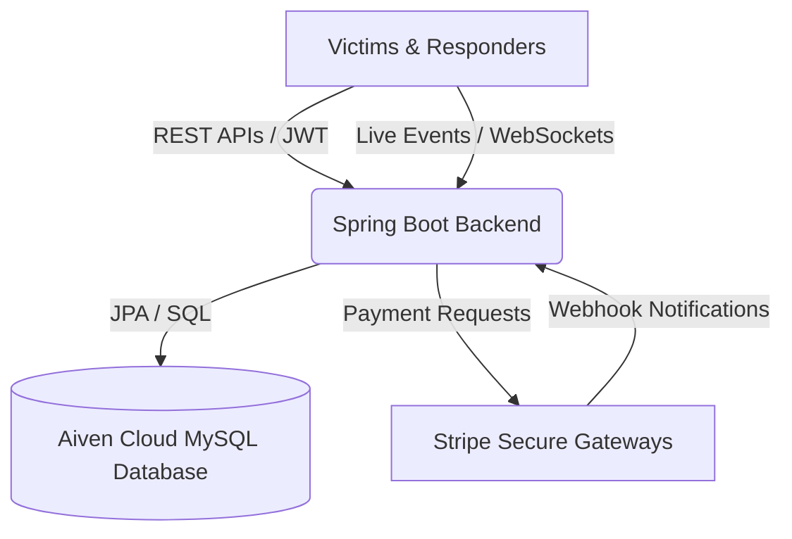

# ResQNest Backend Architecture & System Explanation

Welcome to **ResQNest**—a real-time disaster relief and emergency response coordination platform. This document explains the entire backend architecture, database design, core business logic, and security workflows in simple, understandable English. Use this guide to present and explain the system to your project examiners.

---

## 1. What is ResQNest?

ResQNest is a coordination system designed to help disaster management teams, volunteers, and victims during natural disasters (like floods, earthquakes, and wildfires). 

The platform solves three major challenges in disaster relief:
1. **Prioritization**: Ensuring that the most critical distress calls (SOS alerts) are answered first, and that waiting victims are not forgotten (priority escalation).
2. **Security**: Verifying that relief supplies actually reach the correct victims using secure, time-sensitive QR codes.
3. **Transparency**: Allowing donors to securely send money for emergency shelters using Stripe, and tracking shelter occupancy and inventory in real time.

---

## 2. Technology Stack (How it is Built)

The backend is built using modern, industry-standard technologies:
* **Java 25 & Spring Boot**: The main framework used to build the REST API endpoints and manage the application.
* **Hibernate & Spring Data JPA**: The database connector. It automatically maps Java code objects to database tables and handles queries.
* **MySQL Database**: The relational database used to store all persistent records (hosted securely in the cloud on Aiven).
* **Spring Security & JSON Web Tokens (JWT)**: Handles user authentication. It secures endpoints so that only authorized roles can perform specific actions.
* **Spring WebSockets**: Enables real-time communication. When a victim raises an SOS, it instantly appears on the coordinator's dashboard without refreshing the page.
* **Stripe Java SDK**: Integrates secure credit card payment processing for monetary donations.

---

## 3. High-Level System Architecture

Here is how data flows through the ResQNest system:

---

## 4. Core Modules & Business Logic Explained

### 🔑 A. User Management & Security (Authentication)
* **How it works**: When a user registers (`POST /auth/register`), the system hashes their password using **BCrypt** (a secure encryption algorithm) before saving it in the database.
* **JWT Tokens**: When a user logs in (`POST /auth/login`), the backend generates a signed **JSON Web Token (JWT)**. The frontend stores this token and sends it in the `Authorization` header for every request.
* **Role-Based Access Control**: Different users have different access levels:
  * `VICTIM`: Can raise SOS calls, check in, and generate verification QR codes.
  * `VOLUNTEER`: Can view assigned missions, toggle availability, and scan/verify QR codes.
  * `ADMIN` & `NGO`: Can view global statistics, allocate inventory, assign volunteers, and view operational reports.

### 🚨 B. The Smart SOS Prioritization Engine
One of the most advanced parts of ResQNest is how it handles incoming distress calls.

1. **Base Priority Score Calculation**:
   When a victim submits an SOS, the backend calculates a **Base Priority Score** from `0` to `10` using weighted parameters:
   * **Severity Level** (1 to 5): Weight = `2.0` (Max 10 points)
   * **Medical Emergency** (Yes/No): Weight = `3.0` (If yes, adds 3 points)
   * **Age** (Elderly/Infant): Weight = `2.0` (If victim is over 65 or under 5, adds 2 points)
   * **Disability** (Yes/No): Weight = `1.5` (If yes, adds 1.5 points)
   * **Has Children** (Yes/No): Weight = `1.5` (If yes, adds 1.5 points)
   
   The score is capped at `10.0` and mapped to a category:
   * Score $\ge 8.0$: `EMERGENCY`
   * Score $\ge 5.0$: `HIGH`
   * Score $\ge 3.0$: `NORMAL`
   * Score $< 3.0$: `LOW`

2. **Wait-Time Priority Escalation (Preventing Starvation)**:
   * **The Problem**: If new critical cases keep arriving, a "NORMAL" priority victim might wait forever (starvation).
   * **The Solution**: A background scheduler runs every 60 seconds on the server. For every pending SOS, it calculates a **Dynamic Priority Score**:
     $$\text{Dynamic Score} = \text{Base Score} + (\text{Minutes Waiting} \times 0.5)$$
   * If the dynamic score crosses a threshold, the system elevates the priority (e.g. from `NORMAL` to `HIGH`), logs the escalation in the `priority_logs` table, and broadcasts the update to the coordinators.

### 🏠 C. Shelter Finder & Resident Roster
* **Haversine Distance Sorting**: When a victim requests nearby shelters, the backend implements the **Haversine Formula** (a mathematical formula that calculates the shortest distance between two points on a sphere using latitude and longitude). Shelters are returned sorted by nearest distance.
* **Occupancy Percent**: Every shelter response calculates `capacityPct` dynamically:
  $$\text{Capacity Percentage} = \frac{\text{Occupied Beds} \times 100}{\text{Total Capacity}}$$
* **Resident Assignment**: When an admin assigns a victim to a shelter room, the system records their room number and entry date, and automatically increments the shelter's `occupied` count by `1`.

### 💳 D. Stripe Payment Gateway (Monetary Donations)
* **Checkout Flow**: To donate money, the backend creates a **Stripe Checkout Session** (`POST /api/v1/payments/create-session/{id}`). This returns a secure URL hosted by Stripe. The donor completes the payment on Stripe's secure page, keeping the backend PCI-compliant (never handling raw credit card data).
* **Payment Completion Verification**: Upon successful payment, Stripe redirects the donor back to the platform. The backend supports two verification paths:
  1. **Success Redirect Callback**: Fetches the session details directly from Stripe API to verify payment and marks the donation as `RECEIVED`.
  2. **Webhook Listener**: Receives secure, asynchronous notifications directly from Stripe's servers to handle updates.

### 🎫 E. QR Code Relief Delivery Verification
To prevent theft or misdelivery of supplies:
1. **Token Generation**: The victim generates a verification request (`POST /qr/generate`). The backend creates a secure, unique token linked to the SOS ID, which expires in 15 minutes, and encodes it into a scan-ready **Base64 PNG QR Code image**.
2. **Scan & Complete**: When the volunteer arrives, they scan the QR code. The backend verifies the token (`POST /qr/verify`). If valid and not expired, the system automatically marks the SOS request as `RESOLVED` and records the completion time.

---

## 5. Database Schema Design (Entity Relationship)

Here is how the database tables are structured and connected:

| Table Name | Description | Key Columns | Relationships |
| :--- | :--- | :--- | :--- |
| **`users`** | Stores victims, volunteers, and managers. | `id`, `username`, `email`, `role`, `safety_status`, `assigned_shelter_id` | Many-to-One with `shelters` |
| **`sos_requests`**| Distress calls raised by victims. | `id`, `latitude`, `longitude`, `disaster_type`, `priority`, `status`, `victim_id`, `volunteer_id` | Many-to-One with `users` (Victim & Volunteer) |
| **`shelters`** | Safe houses and evacuation buildings. | `id`, `name`, `capacity`, `occupied`, `status` | One-to-Many with `users` (Residents) |
| **`volunteers`** | Details of rescue volunteers. | `id`, `name`, `email`, `skills`, `status` (AVAILABLE/BUSY) | - |
| **`inventories`** | Relief items (Food, Medicine). | `id`, `item_name`, `quantity`, `threshold`, `status`, `warehouse_location` | Many-to-One with `shelters` |
| **`donations`** | Tracks monetary and item aid. | `id`, `donor_name`, `donation_type` (MONEY/ITEMS), `amount`, `status` | - |
| **`distributions`**| Tracks items dispatched to areas. | `id`, `inventory_id`, `volunteer_id`, `quantity`, `status` | Many-to-One with `inventories` & `volunteers` |
| **`missing_persons`**| Missing persons database. | `id`, `full_name`, `status` (MISSING/FOUND), `photo_url` | - |
| **`priority_logs`**| Historical records of priority escalations. | `id`, `sos_id`, `old_priority`, `new_priority`, `score` | - |
| **`qr_codes`** | Active QR verification tokens. | `id`, `sos_id`, `token`, `expires_at` | - |

---
